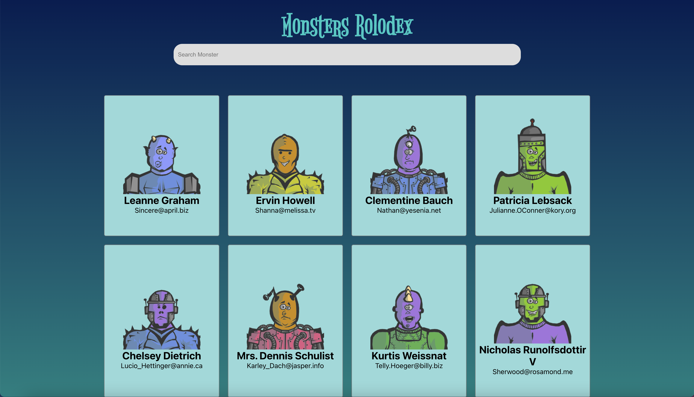

# Getting Started with Create React App

This project was bootstrapped with [Create React App](https://github.com/facebook/create-react-app).

## Available Scripts

In the project directory, you can run:

### `npm start`

Runs the app in the development mode.\
Open [http://localhost:3000](http://localhost:3000) to view it in your browser.

The page will reload when you make changes.\
You may also see any lint errors in the console.

This project was done while taking Zero to Mastery course
on Udemy .

# In this project you'll learn :

1-how to get data from api and show it to the user .

2- implement the search box usong react .

3- learning some style using css .

